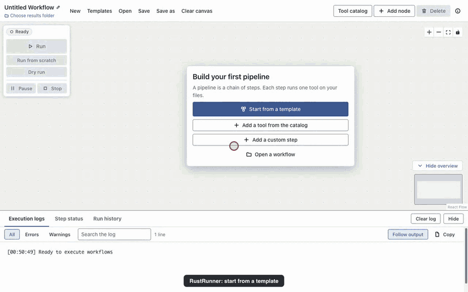
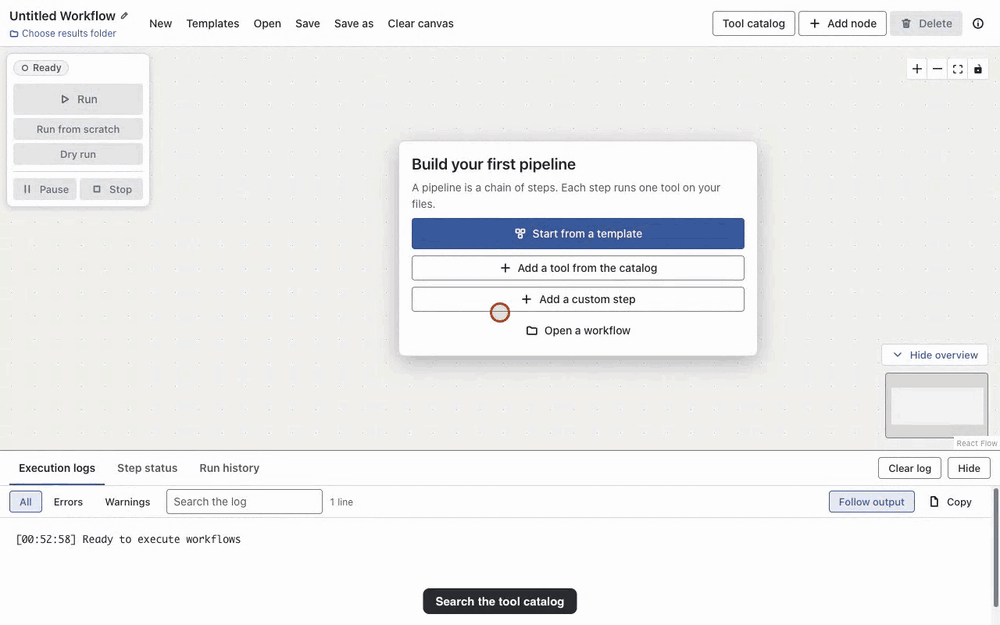
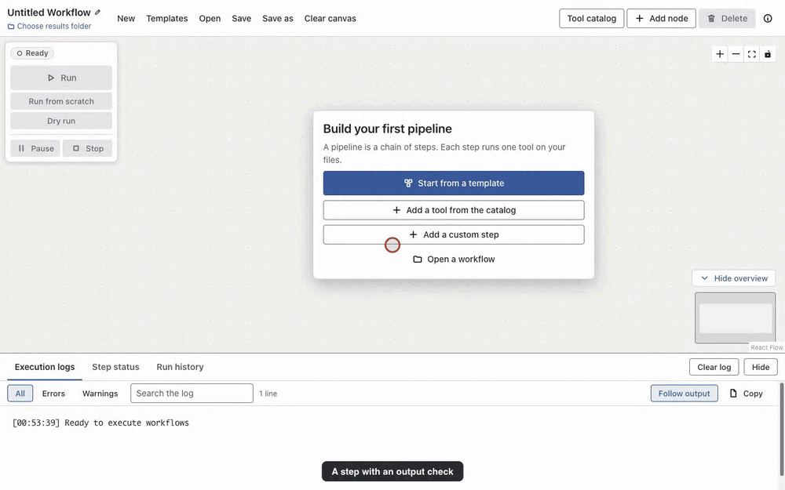

# RustRunner

**Build and run bioinformatics pipelines by drawing them. No workflow language, no command line.**

[](CHANGELOG.md)
[](#limitations-of-the-beta)
[](LICENSE)
[](https://doi.org/10.5281/zenodo.22177901)

> ## Open beta
>
> **1.0.0-beta.1 is the first public beta of RustRunner 1.0.** It is meant to be used and criticised. macOS on Apple silicon is
> the best tested platform; Windows and Linux builds are published but have not been tested end to end. Please
> [report what breaks](https://github.com/hsn-ylmz/RustRunner/issues). The [limitations](#limitations-of-the-beta) are listed
> below, and what changed since 0.11.1 is in the [changelog](CHANGELOG.md).

## What it is

RustRunner is a desktop app for people who analyse sequencing data but are not programmers. You pick a template or add tools
from a catalog, connect them on a canvas, and press **Run**. Every setting is a labelled field with a hint, and every tool
installs itself into its own isolated conda environment the first time it is needed. Nothing has to be written in a workflow
language, and the pipeline never needs a terminal.

Under the canvas is a Rust engine that schedules the steps in parallel, retries and times them out, checks their output files,
skips what is already up to date, and writes an HTML report of every run.

From a template to a finished run (the real app on public Ribo-seq data; long waits are cut from the video, nothing is simulated):



## Features

### Start from a template

14 templates build a whole pipeline from your files. The settings that depend on your library (adapter, UMI, strandedness, genome
size) are asked before the workflow is created, not hidden in a step.

| Field | Templates |
|---|---|
| Read quality | Basic read quality check (FastQC, fastp, MultiQC) |
| RNA sequencing | Ribo-seq with UMIs (riboWaltz); RNA-seq alignment and gene counts (HISAT2, featureCounts); RNA-seq quantification (Salmon) |
| DNA sequencing | Germline variant calling with bcftools (single-end and paired-end); with GATK |
| Epigenomics | ChIP-seq peaks (MACS3); ATAC-seq open chromatin (Genrich) |
| Long reads | Nanopore reads from FASTQ to coverage; Nanopore from raw signal to coverage (Dorado) |
| Metagenomics | Kraken2 and Bracken |
| Genome assembly | Short reads (SPAdes and QUAST); long reads (Flye and QUAST) |

The full list, with the tools each one uses, is on the [project site](docs/library.html) (generated from the app's own data).

### A catalog of 85 tools

Search by name, job or file type. Every entry names each file it reads and writes, installs the tool at a pinned version, and was
run against the real program (not a mock) on small data. "Only tools that fit after the selected step" hides what cannot read
the step's output. The catalog covers quality control, trimming, alignment, BAM processing, variant calling and annotation,
RNA-seq quantification, ChIP and ATAC peak calling and signal tracks, genome intervals, FASTA and FASTQ tools, assembly,
metagenomics, Nanopore signal and Ribo-seq.



### Named input slots and typed connections

A command is built from named file slots ("Reads", "Reference genome"), not from `{placeholders}` you have to know. Connect two
steps and the output goes to the slot that accepts its file type; if two slots fit, you are asked which. A green edge fits, an
orange dashed edge says what the next step expects and what it gets. Everything done by dragging also has a form ("Runs after").

### Runs you can trust

- **Retries, timeouts and output checks.** Set retries (fixed or exponential delay), a time limit per attempt, and checks that
  an output exists, is not empty, or has enough lines. A failed blocking check stops the steps that depend on it.
- **Test runs.** A step can be mocked: the tool is skipped and empty outputs are made, to test the rest of a pipeline.
- **Up-to-date skipping.** Run skips a step whose settings are unchanged, whose outputs exist and whose inputs are not newer;
  Run from scratch runs everything. Edit one step and only it and the steps after it run again.
- **Keep going.** After a failure the independent branches still run, and the run ends as failed.
- **Live status.** Each step shows waiting, running, retrying (with the attempt), done, failed or skipped with an icon and words;
  the log can be searched, filtered and copied. Stop ends the whole process tree of every step.
- **Run report and history.** Every run writes a self-contained HTML report (graph, per-step status, duration, command, checks,
  resource use) and is listed in the Run history. Templates that end in MultiQC give one combined quality report.
- **Failures that explain themselves.** A card names the step, the file and the setting; **Edit step** opens exactly that setting.



### Also

Pause and resume, dry run, resource monitoring, favourites and recently used tools in the palette, your own templates (save any
canvas as a template), light and dark themes, and a keyboard path for building and running a workflow.

## Install

Download the file for your system from the [releases page](https://github.com/hsn-ylmz/RustRunner/releases). The open beta is
marked as a pre-release.

| System | File |
|---|---|
| macOS, Apple silicon | `.dmg` or `.zip` (arm64) |
| macOS, Intel | `.dmg` or `.zip` (x64) |
| Windows 64-bit | `.exe` installer |
| Linux 64-bit | `.AppImage` |

**macOS and Windows warn about an unknown developer.** The builds are not signed. On macOS, drag RustRunner to Applications,
Control-click it, choose **Open**, and confirm. If macOS still refuses ("damaged" or "cannot be opened"), run once:

```bash
xattr -dr com.apple.quarantine /Applications/RustRunner.app
```

**Updates.** The app checks GitHub for a new release when it starts and from **Help > Check for Updates**. On Windows and Linux it
downloads and installs the update; on macOS (unsigned) it tells you and links to the download page. A beta build is offered the
next beta and then the final 1.0; a stable build (0.11.x) is never offered a beta.

**First run.** The app needs micromamba to install tools. If it is missing, Run stops before any step with a card and an
**Install the tool installer** button (a pinned, checksummed download over https). Each tool is installed the first time a
workflow needs it, so the first run needs a network and several GB of disk space; later runs reuse the environments.

## First run: a five-minute tour

1. Open RustRunner and click **Start from a template** (or **Templates** in the toolbar).
2. Pick **Basic read quality check**, choose a FASTQ file under **Your files**, and click **Create workflow**.
3. Click **Choose results folder** (top left) and pick an empty folder.
4. Click **Run**. The steps turn from waiting to running to done; **Open report** on the summary card shows the run report.
5. Try the catalog: **Tool catalog**, search a tool, add it, and drag from one step's lower handle to the next step's upper
   handle. The slot fills in and the edge shows green when the file types fit.

## Example with real data: Ribo-seq

[`riboseq-test/`](riboseq-test/README.md) runs the template **Ribo-seq with UMIs (riboWaltz)** (20 steps) on public human
HEK293T data (GEO GSE158374, run SRR12693498): UMI extraction, rRNA, tRNA and ncRNA depletion, STAR to transcripts, UMI
deduplication, a riboWaltz report and MultiQC. `riboseq-test/prepare_data.sh` downloads and builds the data (checksummed), and the
README there lists the files to choose, the settings, the numbers to expect and what to look at critically. A walkthrough is on the
[project site](docs/ribo-seq.html).

## Run from source

Requirements: [Rust](https://www.rust-lang.org/tools/install) (stable, 2021 edition), [Node.js](https://nodejs.org/) 20 or
newer with npm, and, on Linux, the system libraries Electron needs. micromamba is installed by the app when needed.

```bash
git clone https://github.com/hsn-ylmz/RustRunner.git
cd RustRunner/RustRunner && cargo build          # the engine (debug build, found by the app in development)
cd ../RustRunner-Desktop && npm install
npm start                                        # builds the app and starts it
```

Other scripts in `RustRunner-Desktop`:

| Command | What it does |
|---|---|
| `npm run dev` | Webpack dev server with hot reload, then Electron |
| `npm test` | Unit tests (vitest), including the design-system checks |
| `npm run test:e2e` | Builds the engine and app and drives the real app with Playwright |
| `npm run test:tools` | Opt-in: runs catalog tools and templates against the real programs (installs conda environments; slow) |
| `npm run docs:gifs` | Re-records the GIFs in `docs/media/` from the real app (needs the environments `test:tools` builds, and ffmpeg) |
| `npm run docs:site` | Regenerates the project site in `docs/` from the catalog and templates |
| `npm run package:mac`, `package:win`, `package:linux` | Packages the app (needs `cargo build --release` first) |

Engine tests: `cd RustRunner && cargo test`. The engine can also run a workflow file directly:
`cargo run -- workflow.yaml --dry-run`; `rustrunner --help` lists the options.

## Architecture

```
+-----------------------------+   IPC (contextBridge)   +-----------------------------+
|  Renderer (React + Flow)    | <---------------------> |  Main process (Electron)    |
|  canvas, palette, forms,    |                         |  windows, dialogs, settings,|
|  status, logs, history      |                         |  updates, YAML, run history |
+-----------------------------+                         +--------------+--------------+
                                                                        | spawns, stderr events
                                                                        v
                                                         +-----------------------------+
                                                         |  Rust engine (CLI)          |
                                                         |  parse, validate, plan,     |
                                                         |  schedule, run, check,      |
                                                         |  report; micromamba envs    |
                                                         +-----------------------------+
```

- The renderer holds the canvas and the forms. It knows the tool catalog (`RustRunner-Desktop/src/renderer/tools/catalog.json`)
  and the templates (`RustRunner-Desktop/src/renderer/templates/*.json`), and turns a canvas into a workflow.
- The main process writes the workflow as YAML, starts the engine, passes its events to the renderer, keeps the run history and
  the settings, and does updates. Pause works by a flag file the engine watches.
- The engine (`RustRunner/`) builds the dependency graph, runs independent steps in parallel, installs and enters a conda
  environment per tool, enforces retries, timeouts and output checks, saves the run state under `.rustrunner/`, and reports
  progress as one JSON event per line (`--json-events`) that the app turns into step status and the run report.

## Limitations of the beta

- macOS on Apple silicon is the primary tested platform. Windows and Linux builds are produced by CI but have not been tested
  end to end.
- STAR and a few other tools have no native Apple-silicon build and run as Intel builds, which needs Rosetta.
- Tool versions are pinned, but their conda dependencies are not fully locked, so a later install can resolve a dependency
  differently.
- Tool commands were validated on synthetic and small real data, not on every kind of project. Check the settings of a template
  against your library before trusting its numbers.
- Builds are not signed (see Install). On macOS the app does not install updates by itself.
- Some tools need a database you provide (for example Kraken2); the palette says so before you add them.

## Contributing

Issues and pull requests are welcome. Please run the checks before opening a pull request:

```bash
cd RustRunner && cargo fmt --check && cargo clippy --all-targets -- -D warnings && cargo test
cd ../RustRunner-Desktop && npx tsc -p tsconfig.main.json --noEmit && npx tsc -p tsconfig.json --noEmit && npm test && npm run test:e2e
```

UI changes follow the design rules in `.claude/skills/ui-ux/SKILL.md` (tokens only, primitives from `src/renderer/ui`, plain
words). To add a catalog tool, add an entry to `catalog.json` and a case to the real-tool suite (`npm run test:tools`).

## Citation and license

If you use RustRunner in published work, please cite it with its DOI, and cite the tools your pipeline ran; each template
lists its references.

> Yilmaz H. RustRunner: a visual, no-code workflow builder for bioinformatics. Zenodo.
> [doi:10.5281/zenodo.22177901](https://doi.org/10.5281/zenodo.22177901)

This DOI always points to the latest release. Each release also has a DOI of its own on
[Zenodo](https://doi.org/10.5281/zenodo.22177901); to cite the exact version you used (`rustrunner --version` or
**Help > About RustRunner**), use that one. GitHub's **Cite this repository** button (from [CITATION.cff](CITATION.cff))
gives the same reference as APA or BibTeX.

RustRunner is released under the [MIT License](LICENSE). Author: Hasan Yilmaz
([ORCID 0009-0007-8042-8144](https://orcid.org/0009-0007-8042-8144)).

Built with [Electron](https://www.electronjs.org/), [React Flow](https://reactflow.dev/), [Rust](https://www.rust-lang.org/),
[Tokio](https://tokio.rs/) and [micromamba](https://mamba.readthedocs.io/).
